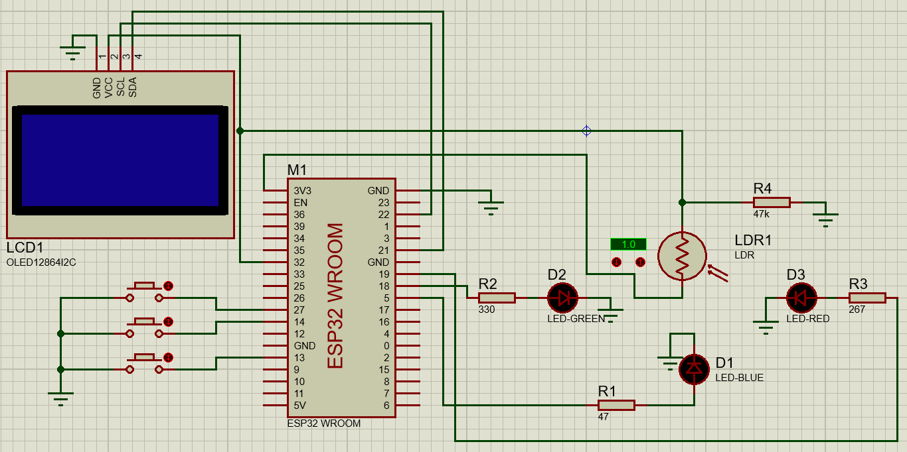
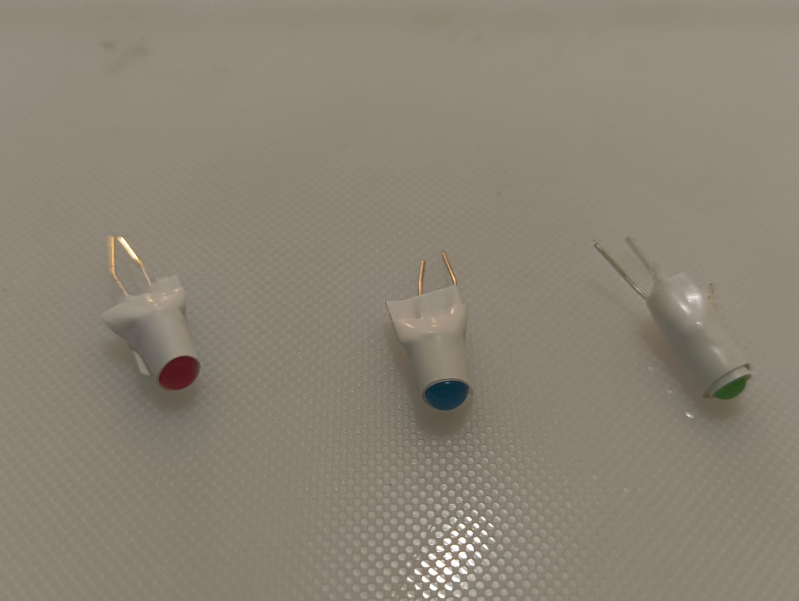
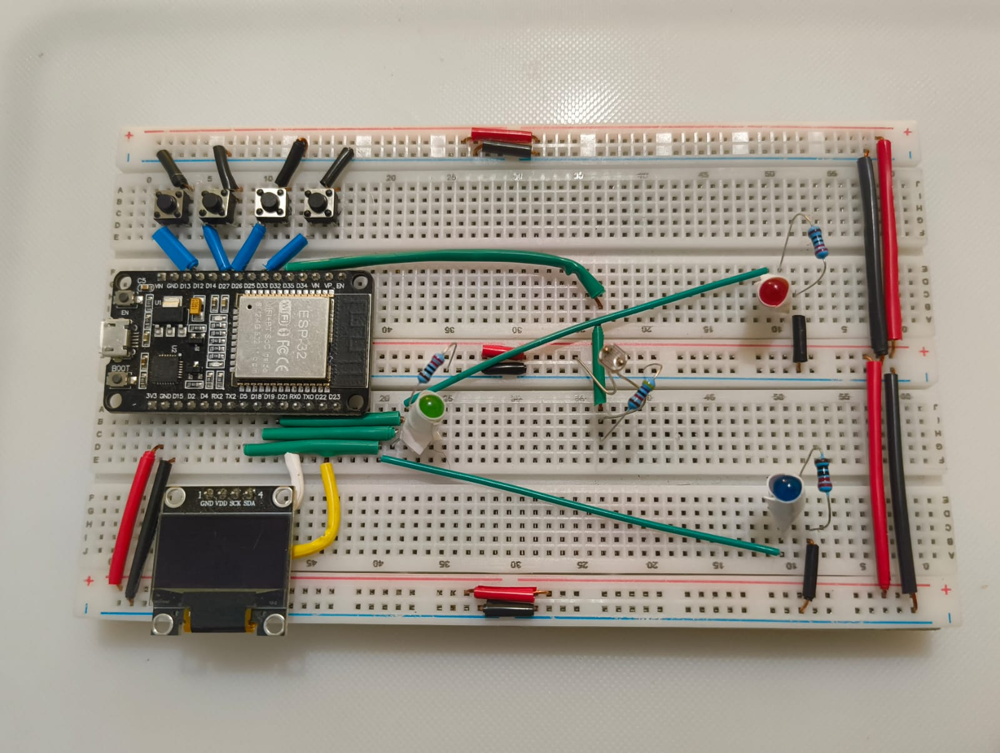
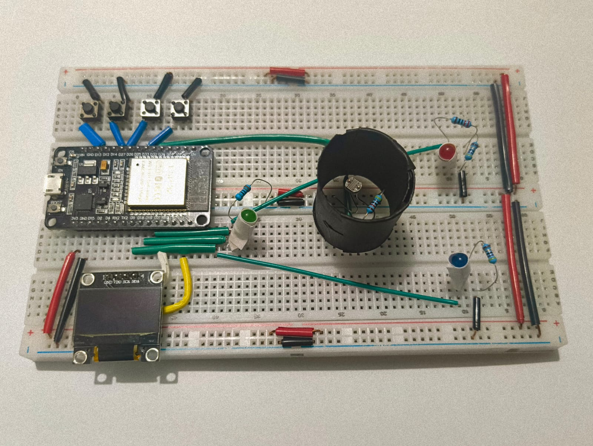
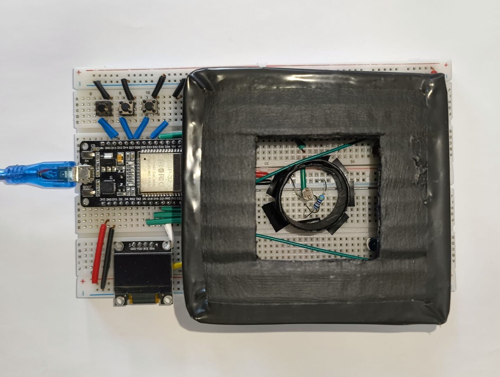

# 🎨 Sistema de Detección de Color con ESP32

## 📌 Descripción

Este proyecto implementa un sistema de detección de color utilizando un microcontrolador ESP32, LED´s RGB y una fotorresistencia (LDR). El sistema ilumina un objeto con diferentes colores y mide la luz reflejada para determinar su color mediante procesamiento digital.

---

## 🎯 Objetivo

Desarrollar un sistema embebido capaz de detectar colores mediante iluminación controlada y adquisición de datos analógicos.

---

## 🔧 Hardware utilizado

- ESP32 WROOM-32  
- LED´s (Rojo, Verde, Azul)  
- Fotorresistencia (LDR)  
- Resistencias (47Ω, 220Ω, 330Ω y 47kΩ)  
- Pantalla OLED SSD1306  
- Botones  
- Protoboard y cables  

---

## 🔌 Configuración de pines

| Elemento | GPIO | Dirección | Descripción  |
|----------|------|----------------|------------|
| LED_R | 19 | OUTPUT | LED rojo |
| LED_G | 18 | OUTPUT | LED verde |
| LED_B | 5  | OUTPUT | LED azul |
| BTN_S | 13 | INPUT_PULLUP | Selección de modo |
| BTN_R | 14 | INPUT_PULLUP | Cambio de LED / inicio de medición |
| BTN_A | 27 | INPUT_PULLUP | Mostrar resultado |
| LDR_ADC | 32 | INPUT (ADC) | Entrada analógica |
| OLED_SDA | 21 | I2C | Datos OLED |
| OLED_SCL | 22 | I2C | Reloj OLED |

---

## ⚙️ Funcionamiento

1. Se ilumina el objeto con LEDs RGB.
2. La LDR detecta la luz reflejada.
3. El ESP32 convierte la señal mediante el ADC.
4. Se procesan los datos.
5. Se determina el color.
6. Se muestra en la pantalla OLED.

---

## 🎮 Modos de operación

### Manual
- Permite seleccionar cada LED
- Muestra valores individuales

### Automático
- Mide los tres colores automáticamente
- Determina el color final

---

## 📸 Imágenes

### Circuito


### Recubrimiento de LED´s


### Circuito físico armado


### Tubo para la fotorresistencia


### Estructura externa


---

## 📁 Estructura

```
ProyectoParcial/
├── Proyecto Parcial/
	├── CmakeList
	├── sdkconfig
	├── sdkconfig.defaults
	├── sdkconfig.old
	├── build/
	├── main/
	      ├── CmakeList
	      ├── component.mk
	      ├── main.c
	
├── components/
├── imagenes/
├── README.md
```

---

## 🔄 Historial

- Inicio proyecto
- Configuración inicial ADC y OLED
- Configuración periféricos
- Reasignación LED´s
- Prueba edición
- Prueba edición
- Resultados individuales de cada LED´s en OLED
- Conversión en porcentaje de los resultados
- Botón 2: Detección de colores
- Correción de detección de colores
- Calibración de valores en colores
- Botón 3: Detección de color automática
- Configuración de OLED en detección de color automática
- Reorganización del código y reasignación de botones
- Corrección de detección automática y ajuste de OLED
- Creación de README
- Correción de README
- Mejora de interfaz
- Mejora de clasificación de colores mediante normalización por suma
- Configuracion final de interfaz
- Cambio de nombre a botones y eliminación de código repetido
- Actualización README
- 
---

## ⚠️ Limitaciones

- Sensible a luz externa
- Precisión limitada de la LDR

---

## 📚 Autores

- Areli Montelongo Prado
- Santos Azael López Meza
